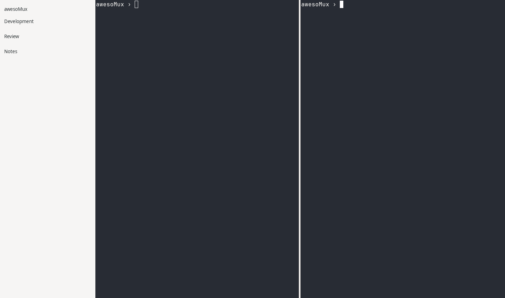

# awesoMux Linux GTK experiments

This private repository contains two native GTK4 implementation tracks for the
Linux edition of awesoMux:

- `swift-gtk/` is the active first implementation using Swift and SwiftGtk4.
- `rust-gtk/` is the prepared fallback using Rust and gtk4-rs.

Both tracks use the same product contract, exact wording, visual references,
resources, canonical Ghostty pin, and awesoMux-owned Ghostty GTK shim. The
shared boundary prevents a language change from discarding the difficult
terminal integration and product-parity work.

Read `AGENT_PROMPT.md` first, then the prompt inside the selected track. Start
with `swift-gtk/AGENT_PROMPT.md`. Do not work on both tracks at the same time
unless Sarah explicitly asks for a comparison.

Progress screenshots are stored under:

```text
artifacts/visual-qa/swift-gtk/
artifacts/visual-qa/rust-gtk/
```

## Visual QA index

| Date | Track | Milestone | Evidence |
| --- | --- | --- | --- |
| 2026-08-28 | SwiftGtk4 | Pinned Ghostty renders two independent terminal surfaces in one native GTK4 window. Prompts are intentionally sanitized. | [Open full-resolution PNG](artifacts/visual-qa/swift-gtk/2026-08-28-terminal-integration.png) |



The macOS awesoMux project is a read-only reference. Work in this repository
must never change it.

This repository intentionally has no CI. All builds, tests, packaging checks,
and visual QA run locally on i5GamingPC. Do not add GitHub Actions or another
remote build service.
